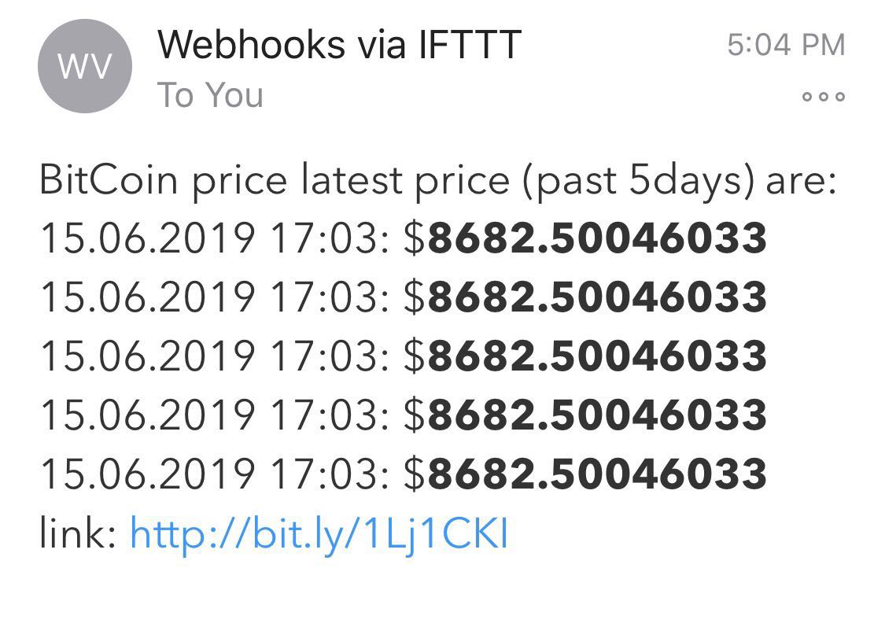

# TrackBitCoinPrice
Use IFTTT to track the latest bitcoin price. 

***
Technology:

<ol>
  <li>IFTTT</li>
  <li>CoinMarket API</li>
  <li>Python</li>
  <li>requests module</li>
</ol>

Links: 
[IFTTT](https://ifttt.com)  
[Coinmarket](https://coinmarketcap.com/api/documentation/v1/#section/Quick-Start-Guide)
***

> What can you do?

* Be notified for bitcoin price during a specific period e.g. Every 5 seconds.on your ios device
* Be notified through email about the update price list. In this case, it can be an overview of the last 5 price. 

## Example

